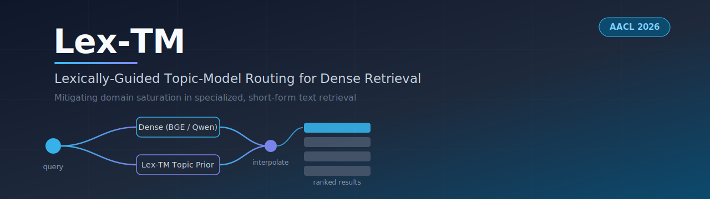
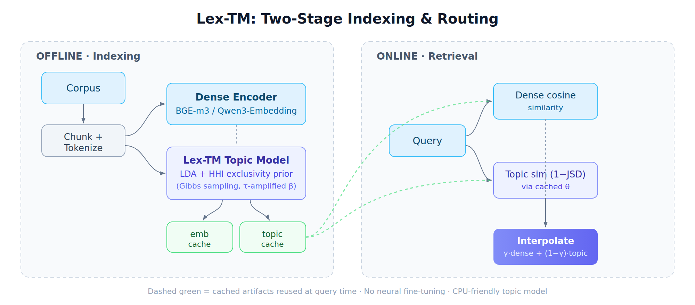

<div align="center">



<h1>Lex-TM: Topic-Model Routing for Dense Retrieval</h1>

<p>Code, settings, seeds, per-query outputs and the full changelog for<br/>
<b>Escaping the Tokenizer Trap: Probabilistic Semantic Routing for Dense Retrieval in Specialized Domains</b><br/>
Siu Hin Ng, Yung-Chun Chang, Chao-Lin Liu, Wei-Yun Ma, Wen-Lian Hsu. AACL-IJCNLP 2026 (Main).</p>

<p>
  <a href="#quickstart">Quickstart</a> ·
  <a href="#results">Results</a> ·
  <a href="#reproducing-the-paper">Reproduce</a> ·
  <a href="#exact-settings-and-seeds">Settings</a> ·
  <a href="#released-outputs">Outputs</a> ·
  <a href="#changelog">Changelog</a> ·
  <a href="#citation">Cite</a>
</p>

</div>

---

## Overview

Dense retrievers can blur the distinctions between short, jargon-heavy records
that share most of their vocabulary. **Lex-TM** is a training-free layer that
interpolates dense cosine similarity with the Jensen–Shannon similarity of
topic distributions from an LDA model whose topic–word prior is scaled by a
Herfindahl–Hirschman (HHI) exclusivity score:

    s(q, d) = γ_q · (cos(e_q, e_d) + 1)/2  +  (1 − γ_q) · (1 − d_JS(θ_q, θ_d))

The topic model is fitted by collapsed Gibbs sampling (Numba-compiled, CPU
only); no neural network is trained or fine-tuned.

<div align="center">

</div>

### What the paper finds

- **MedWeb, English:** Lex-TM reaches MRR@20 **0.8151** against **0.7081** for
  BM25 + dense reciprocal rank fusion (RRF); the paired difference is
  +0.107 [+0.041, +0.181] and significant. In Japanese and Chinese the
  differences from RRF are not significant.
- **Qwen3-Embedding-0.6B:** routing improves on dense retrieval significantly
  in English and Chinese; the Japanese gain (+0.023) is not significant.
- **Stronger retrievers:** SPLADE++ and BGE-M3's multi-vector mode match or
  exceed Lex-TM on MedWeb. Lex-TM's advantage over them is index size, not
  accuracy.
- **Label strings:** with the label strings removed from the indexed tweets,
  routing no longer improves on dense retrieval in English or Chinese.
- **The HHI prior brings no benefit:** on short texts it reduces to a rarity
  weight, and a symmetric prior performs as well across five Gibbs seeds.
- **Outside MedWeb**, routing matches dense retrieval on CmedqaRetrieval and
  lowers nDCG@10 on ChatDoctor, FiQA-2018, TREC-COVID and NFCorpus.

Routing helps only inside a narrow operating envelope: a specialized domain,
heavy lexical overlap with a few distinguishing terms, and short documents that
each concentrate on one topic (paper, Section 6.3).

---

## Quickstart

```bash
pip install -r requirements.txt
python -m nltk.downloader punkt punkt_tab stopwords wordnet   # required, see below

# MedWeb, all three languages, every system in the paper's Table 1
# (BGE-M3 and Qwen3-Embedding-0.6B; minutes on one RTX 4090)
cd pipelines/v3_patched
python camera_ready_extras.py medweb \
    --medweb_dir /path/to/ntcir13_MedWeb_TestCollection \
    --encoders bge-m3,qwen3-0.6b --out ../../my_results
```

Single configuration with the pipeline's driver script (Lex-TM, Pure BM25 and
RRF in one run, each with a bootstrap 95% CI and the paired tests):

```bash
cd pipelines/v3_patched
python main_pipeline1_patched.py \
    --dataset_name medweb_en --filepath /path/to/medweb_rag_en_fixed.csv \
    --gamma 0.7 --tau 0.8 --num_topics 20 --chunk_size 512 \
    --query_smoothing 0.0 --adaptive_gamma --run_bm25
```

**NLTK `punkt` must load.** Without it, `rag_dataload.py` falls back to a regex
tokenizer for English, which changes the English vocabulary (921 terms instead
of 909) and every English result (Pure BM25 0.6327 instead of 0.6566).
`camera_ready_extras.py` stops with a message when `punkt` is missing and warns
when the English MedWeb vocabulary is not 909. See `docs/FIXES.md`, #15 and #30.

Requirements: Python 3.10+ and `numpy<2`, which the `numba` Gibbs sampler
needs (see `requirements.txt`). A CUDA GPU is recommended for the dense encoders; the
topic model runs on CPU.

---

## Results

All numbers below are copied from the paper and are produced by the files in
[`results/camera_ready/`](results/camera_ready/). Brackets give 95% bootstrap
intervals; Δ rows give Lex-TM's mean per-query difference with a paired
bootstrap interval (10,000 resamples).

### MedWeb label-set retrieval (MRR@20, 39 label sets per partition; paper Table 1)

| System | English | Japanese | Chinese |
|---|---|---|---|
| Pure BM25 | 0.6566 | 0.5855 | 0.7579 |
| BGE-M3 learned sparse | 0.5687 | 0.6935 | 0.5944 |
| BGE-M3 multi-vector (late interaction) | 0.8387 | 0.8036 | 0.7786 |
| BGE-M3 dense + sparse + multi-vector | 0.7475 | 0.7434 | 0.7158 |
| SPLADE++ | 0.8631 | – | – |
| **Encoder: BGE-M3** | | | |
| Pure Dense | 0.6596 [0.52, 0.79] | 0.6323 [0.50, 0.76] | 0.6266 [0.49, 0.76] |
| BM25 + Dense RRF (k = 60) | 0.7081 [0.58, 0.83] | 0.6883 [0.55, 0.82] | 0.7716 [0.65, 0.88] |
| LDA routing (τ = 1.1, symmetric prior)* | 0.8147 [0.70, 0.92] | 0.7062 [0.57, 0.83] | 0.7415 [0.61, 0.86] |
| **Lex-TM (τ = 0.8)** | **0.8151** [0.70, 0.92] | 0.7063 [0.57, 0.83] | 0.7420 [0.62, 0.86] |
| Δ vs. RRF | +0.107 [+0.041, +0.181] | +0.018 [−0.063, +0.104] | −0.030 [−0.095, +0.031] |
| Δ vs. Pure BM25 | +0.159 [+0.055, +0.270] | +0.121 [−0.005, +0.247] | −0.016 [−0.117, +0.083] |
| **Encoder: Qwen3-Embedding-0.6B** | | | |
| Pure Dense | 0.7436 [0.62, 0.85] | 0.7949 [0.68, 0.90] | 0.6849 [0.55, 0.81] |
| BM25 + Dense RRF (k = 60) | 0.7944 [0.67, 0.91] | 0.7604 [0.63, 0.88] | 0.7965 [0.68, 0.90] |
| **Lex-TM (τ = 0.8)** | **0.8515** [0.75, 0.94] | **0.8175** [0.71, 0.92] | **0.8241** [0.71, 0.92] |
| Δ vs. Pure Dense | +0.108 [+0.045, +0.178] | +0.023 [−0.021, +0.069] | +0.139 [+0.064, +0.229] |

<sub>*Without entropy adaptation. SPLADE++ uses `naver/splade-cocondenser-ensembledistil` and is English-only.
We call a difference significant when the paired interval excludes zero and a
paired randomization test gives p < 0.05 (paper Table 7).</sub>

### Collections beyond MedWeb (BGE-M3, γ = 0.7; paper Table 2)

| Collection | Type | Metric | BM25 | Dense | RRF | Lex-TM | Δ vs. Dense |
|---|---|---|---|---|---|---|---|
| ChatDoctor (en) | medical Q&A | nDCG@10 | 0.3325 | 0.5806 | 0.4967 | 0.4933 | −0.087 |
| CmedqaRetrieval (zh) | medical QA | nDCG@10 | 0.1568 | 0.3372 | 0.2595 | 0.3343 | −0.003 |
| FiQA-2018 (en) | finance QA | nDCG@10 | 0.2122 | 0.4025 | 0.3374 | 0.2887 | −0.114 |
| TREC-COVID (en)‡ | biomedical | nDCG@10 | 0.4485 | 0.5699 | 0.6603 | 0.4069 | −0.163 |
| NFCorpus (en)‡ | biomedical | nDCG@10 | 0.2661 | 0.2900 | 0.3079 | 0.2575 | −0.033 |
| MIRACL (zh)‡ | open domain | MRR@20 (pairs) | 0.2035 | 0.4474 | 0.3240† | 0.4479 | +0.001 |
| Mr. TyDi (ja)‡ | open domain | MRR@20 (pairs) | 0.4003 | 0.7724 | 0.5896† | 0.7726 | +0.000 |
| Mr. TyDi (th)‡ | open domain | MRR@20 (pairs) | 0.4929 | 0.8259 | 0.6774† | 0.7811 | −0.045 |

<sub>‡Earlier-pipeline runs from the submitted version, not repeated for the
camera-ready (`docs/REPRODUCING_TABLES.md`, Section 3; paper Appendix G); they use a
sparsity gate (δ = 5 on the open-domain sets, δ = 3 on TREC-COVID and NFCorpus).
†RRF with k = 600 (earlier baseline script). CmedqaRetrieval is the full corpus
(dev split).</sub>

---

## Reproducing the paper

Every table and figure maps to a command in
**[`docs/REPRODUCING_TABLES.md`](docs/REPRODUCING_TABLES.md)**. The camera-ready
run is one script:

```bash
export LEXTM_DATA=/path/to/data      # holds ntcir13_MedWeb_TestCollection/ and beir/
bash scripts/run_camera_ready.sh     # writes results/camera_ready_rerun/
```

It runs four independent blocks: MedWeb in three languages with both
encoders, all baselines, the γ and τ sweeps, Gibbs seeds 42–46, the
query-type breakdown, the Figure 1 case and the label-free control; FiQA-2018
(downloaded automatically); ChatDoctor; and CmedqaRetrieval on the full
corpus. In our run on one RTX 4090 they took about 5 min (with cached MedWeb
document embeddings), 1.5 h, 20 min and 2.3 h (including the export).
It then rebuilds `results_generated.tex`, the macro file the paper's LaTeX
source reads, so every number in the paper traces to one JSON field.

`python pipelines/v3_patched/camera_ready_extras.py selftest` checks the
scoring code offline with mock encoders (no GPU, no downloads).

### Data

Datasets are not redistributed.

| Dataset | Used for | How to obtain |
|---|---|---|
| NTCIR-13 MedWeb (EN/JA/ZH) | Tables 1, 3, 4, 6–9; Figure 1 | NTCIR data agreement; `python pipelines/v3_patched/data_prep/build_medweb_csv.py --medweb_dir <dir>` builds `medweb_rag_{en,ja,zh}_fixed.csv` (label strings as queries) from the six NTCIR-13 files |
| FiQA-2018 | Tables 2, 10 | BEIR; downloaded by `camera_ready_extras.py beir --download` |
| ChatDoctorRetrieval | Tables 2, 10 | `python pipelines/v3_patched/export_chatdoctor_to_beir.py --out_dir <dir>` (Hugging Face `mteb/ChatDoctorRetrieval`) |
| CmedqaRetrieval | Tables 2, 10 | `python pipelines/v3_patched/camera_ready_extras.py export_cmedqa --out_dir <dir> --n_docs 0` (full corpus, C-MTEB) |
| TREC-COVID, NFCorpus | Table 2 (earlier pipeline) | BEIR |
| MIRACL-zh, Mr. TyDi-ja/th | Table 2 (earlier pipeline) | Hugging Face; `data_prep/download_miracl_chinese.py`, `data_prep/download_mr_tydi.py` (100K-passage samples keeping every judged passage) |
| THUCNews, Sogou | Table 11 (earlier pipeline) | public Chinese news corpora |
| Airline passenger reviews (en, zh) | Table 11 (earlier pipeline) | not redistributed; `rag_dataload.py` documents the expected columns |

---

## Exact settings and seeds

These are the settings of the paper's Table 5. `config` in
`results/camera_ready/*.json` records each run's command-line settings; the
fixed ones (α, β, λ, sweeps, tolerance, RRF k, bootstrap resamples, chunking)
are constants in `camera_ready_extras.py` (`train_lextm`, `make_loader`,
`TOP_K`, `RRF_K`, `B_BOOT`, `SEED`).

| Setting | Value |
|---|---|
| Topics K | 20 (MedWeb), 50 (other collections) |
| α, β_base, λ | 0.1, 0.01, 2.0 |
| Exclusivity threshold τ | 0.8 (τ = 1.1 switches the HHI prior off) |
| Interpolation weight γ; adaptation | 0.7; entropy adaptation, at most −0.2 |
| Sparsity gate δ | 5, open-domain sets only (not used on MedWeb) |
| Gibbs sampling | at most 500 sweeps; burn-in of 50 sweeps before the first convergence check; then early stop if the log-likelihood changes by < 1e-4 between checks 50 sweeps apart (never triggered on MedWeb, so every MedWeb model runs 500 sweeps) |
| Seeds | Gibbs seed 42 for every main result, 43–46 for the seed study; seed 42 for bootstrap resampling and corpus subsampling |
| Vocabulary | minimum document frequency 2 |
| Chunk size | 512 tokens, overlap 73 (every MedWeb document is one chunk) |
| Dense encoders | `BAAI/bge-m3`; `Qwen/Qwen3-Embedding-0.6B` with its `query` prompt on queries only |
| RRF k | 60 |
| Bootstrap | 10,000 resamples for the CIs and for the paired tests |
| Randomization test | 10,000 sign flips, two-sided |

How τ and γ were chosen is part of the record: γ = 0.7 was fixed after early
sweeps on all MedWeb label sets, and τ = 0.8 was chosen on seven validation label
sets that the reported results include (paper Section 4.4 and Appendix B;
`docs/TAU_VALIDATION_PROTOCOL.md`). Neither was chosen strictly out of sample,
which is why the paper reports both sweeps in full.

---

## Released outputs

[`results/camera_ready/`](results/camera_ready/) holds the outputs of the run
behind the paper (finished 27 Sep 2026):

- `medweb_results.json`: every system, CI, paired test, sweep, seed run,
  breakdown, Figure 1 candidate and label-free result, **with per-query
  reciprocal ranks for every MedWeb system** (27 in English, 26 in Japanese
  and Chinese, where SPLADE++ was not run);
- `per_query/medweb_{en,ja,zh}.csv`: the same per-query values as one table
  per language (one row per label set; `scripts/export_per_query_csv.py`);
- `beir_{fiqa,chatdoctor,cmedqa}_results.json`: aggregate metrics and paired
  statistics (win/loss/tie counts, intervals, p-values);
- `results_generated.tex`: the macro file the paper reads;
- `logs/`: the console logs of the run.

MedWeb document texts are removed from the released outputs except the case
printed in Figure 1. See
[`results/camera_ready/README.md`](results/camera_ready/README.md) for the
field layout, these edits, and what the run did not save.

---

## Repository structure

```
Lex-TM/
├── pipelines/
│   ├── v3_patched/        # current pipeline: produces every camera-ready number
│   │   ├── lex_tm_model.py                  # HHI-scaled LDA, Numba Gibbs sampler
│   │   ├── rag_dataload.py                  # loaders, tokenization, chunking
│   │   ├── rag_evaluation_pipeline_patched.py  # routing layer, baselines, bootstrap tests
│   │   ├── main_pipeline1_patched.py        # single-configuration driver
│   │   ├── camera_ready_extras.py           # every experiment in the camera-ready paper
│   │   ├── export_chatdoctor_to_beir.py     # benchmark export
│   │   ├── export_cmedqa_to_beir.py         # benchmark export (subsample option)
│   │   ├── data_prep/                       # MedWeb files from NTCIR-13; MIRACL and Mr. TyDi downloads
│   │   └── run_all.sh, diagnose_medweb.sh, copy_cache.sh
│   ├── v2_validation/     # validation-split pipeline (paper Table 6)
│   └── v1_original/       # earlier pipeline (provenance; earlier-pipeline rows)
├── scripts/
│   ├── run_camera_ready.sh        # the camera-ready run, all four blocks
│   ├── match_topics.py            # pairs topics by shared top words (Table 4)
│   ├── export_per_query_csv.py    # per-query CSV from medweb_results.json
│   └── analysis/                  # descriptive statistics of Sections 4.1 and 6.2–6.4
├── results/camera_ready/  # outputs of the run behind the paper
├── docs/
│   ├── FIXES.md                    # changelog: every issue found and fixed
│   ├── REPRODUCING_TABLES.md       # command for every table and figure
│   ├── REPRODUCIBILITY_GUIDE.md    # setup, caching, pipeline versions
│   ├── TAU_VALIDATION_PROTOCOL.md  # how τ was chosen, and a protocol for future work
│   └── GIBBS_DETERMINISM_FIX.md    # open issue: sampler reproducibility across code paths
├── assets/
├── requirements.txt
└── LICENSE
```

`lex_tm_model.py` is the same file in all three pipeline versions
(`md5sum pipelines/*/lex_tm_model.py`); for this release, four comment and
message lines were edited in all three copies.

---

## Changelog

[`docs/FIXES.md`](docs/FIXES.md) lists every issue we found while building and
re-running the pipeline, in the order found, with symptom, root cause, fix and
effect on results, including the bugs that changed results and the earlier
numbers that the camera-ready run superseded (#25–#38). The main corrections:

- paired differences computed before the camera-ready run mixed τ = 0.5 on 32
  test label sets with baselines on all 39; the same-query test gives +0.107
  against RRF (#26);
- the submitted English headline (0.8312) used τ = 0.5 although the validation
  rule chose τ = 0.8 (#27);
- the NLTK fallback tokenizer changes English results; it is not
  behaviour-preserving as #15 first stated (#30);
- the Qwen3 Japanese gain is not significant, and CmedqaRetrieval on the full
  corpus matches dense retrieval rather than improving on it (#31, #33).

---

## Citation

```bibtex
@inproceedings{ng-etal-2026-escaping,
  title     = {Escaping the Tokenizer Trap: Probabilistic Semantic Routing
               for Dense Retrieval in Specialized Domains},
  author    = {Ng, Siu Hin and Chang, Yung-Chun and Liu, Chao-Lin and
               Ma, Wei-Yun and Hsu, Wen-Lian},
  booktitle = {Proceedings of the 5th Conference of the Asia-Pacific Chapter
               of the Association for Computational Linguistics and the 15th
               International Joint Conference on Natural Language Processing},
  year      = {2026},
  publisher = {Association for Computational Linguistics}
}
```

---

## Acknowledgments

This study was supported by the National Science and Technology Council of
Taiwan under grants NSTC 114-2410-H-038-034-MY3, NSTC 113-2627-M-A49-002, and
NSTC 114-2221-E-004-001-MY2.

## License

Code released under the [MIT License](LICENSE). The datasets keep their own
licenses and are not redistributed here.
